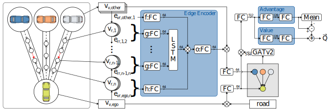

# Deep Reinforcement Learning for Autonomous Driving Using High-Level Heterogeneous Graph Representations

This is our official implementation of the paper "Deep Reinforcement Learning for Autonomous Driving Using High-Level Heterogeneous Graph Representations"
presented at ICRA 2023. You may find the draft version [here](http://www.tnt.uni-hannover.de/papers/data/1638/ICRA23_0751.pdf).
The final version has been published by IEEE [here](https://ieeexplore.ieee.org/document/10160762).


## Abstract

Graph networks have recently been used for decision making in automated driving tasks for their ability to capture a variable number of traffic participants. Current high-level graph-based approaches, however, do not model the entire road network and thus must rely on handcrafted features for vehicle-to-vehicle edges encompassing the road topology indirectly. We propose an entity-relation framework that intuitively models the road network and the traffic participants in a heterogeneous graph, representing all relevant information. Our novel architecture transforms the heterogeneous road-vehicle graph into a simpler graph of homogeneous node and edge types to allow effective training for deep reinforcement learning while introducing minimal prior knowledge. Unlike previous approaches, the vehicle-to-vehicle edges of this reduced graph are fully learnable and can therefore encode traffic rules without explicit feature design, an important step towards a holistic reinforcement learning model for automated driving. We show that our proposed method outperforms precomputed handcrafted features on intersection scenarios while also learning the semantics of right-of-way rules.



## Installation

Due to the nature of installing torch and specific dependencies of torch that need to be compiled against it, we recommend using conda and pip install 
commands directly rather than specifying an `environment` file. To install, execute:

```shell
conda create -n hgrl python=3.8
conda activate hgrl
pip install gym==0.21.0 hydra-core==1.2.0 numpy==1.24.3 protobuf==3.19.1 sumolib==1.10.0 libsumo==1.10.0 traci==1.10.0 eclipse-sumo==1.10.0 wandb==0.12.6 Shapely==1.8.0
pip install torch==1.10.0  --index-url https://download.pytorch.org/whl/cpu
pip install torch-geometric==2.0.2 torch-scatter==2.0.9 torch-sparse==0.6.12 lightning-bolts==0.4.0 pytorch-lightning==1.4.9 protobuf==3.19.1 tensorboard==2.7.0 torchmetrics==0.6.0 setuptools==59.5.0
```

You may have to also point SUMO to its own data folder by setting `$SUMO_HOME` to `<CONDA-ENV-PATH>/lib/python3.8/site-packages/sumo`. 

Note that above commands install a CPU version of pytorch. If you wish to install a GPU version follow the instructions specific
to your architecture, but be warned that installing the `torch-*` libraries is more tricky and may require a full installation of
the CUDA toolkit. Consult the documentation of specific libraries when running into trouble.

## Running

To run the main experiment of our paper including our proposed method and the competitor with handcrafted features, simply execute `bash run_main.sh`. Note that this trains a lot of RL agents in series,
which may take weeks. To repeat the experiment in a practical way, you should use a compute cluster such as SLURM. 
Consult the documentation of the `hydra` package ([here](https://hydra.cc/docs/plugins/submitit_launcher/)) to correctly configure the `hydra`-launcher for your compute cluster.

The most important configuration options found in `conf/config.yaml` are:

Option | Description
--- | ---
`architecture.edge_mode` | Either `lstm2` for our proposed method or `handcrafted` for handcrafted features.
`env.train` | The training scenario(s) to use, one of `S1`, `S2`, `S3`, `S4`, `S5` for single scenarios. `All` for all five scenarios. `-S1` for everything but the first, `-S2` but the second, etc.
`env.eval` | `true` to evaluate on training scenarios, `false` for no evaluation, `opposite` to evaluate on opposite of training if using a `-*` training option (the left out one).

By using these options you may train a single agent and evaluate it, i.e. `python main.py 'architecture.edge_mode=lstm2'` trains our proposed method on all scenarios and evaluates on all scenarios.

## Citing

Please cite this work as:

```bibtex
@inproceedings { SchRei2023a,
  author = {Maximilian Schier and Christoph Reinders and Bodo Rosenhahn},
  title = {Deep Reinforcement Learning for Autonomous Driving Using High-Level Heterogeneous Graph Representations},
  booktitle = {International Conference on Robotics and Automation (ICRA)},
  year = {2023},
  pages = {to appear}
}
```
